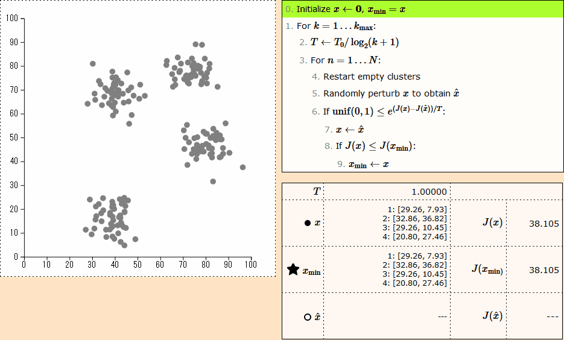

# simulated-annealing-viz

[Click here to access the page!](https://vgarciasc.github.io/simulated-annealing-viz/)

# What is it? 

A web visualization tool of the **Simulated Annealing** (SA) algorithm, applied to the 2D clustering problem. The goal is to make crystal clear how the algorithm works, and to achieve that we provide:

1. The pseudo-code running in real-time;
2. The ability to advance the algorithm step-by-step;
3. The current values of each variable;
4. The 2D visualization of each solution;
5. An explanation of how the algorithm works.

# Other info

This page was cobbled together using D3.js and jQuery. All bugs are my own.

Made during the course on "Nature-inspired Optimization" offered on the Electrical Engineering Department in 2022/1.
